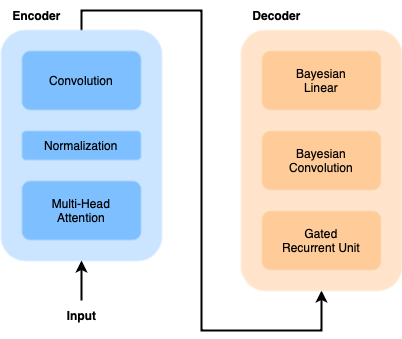
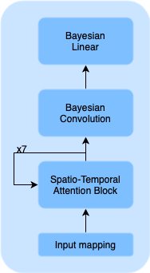
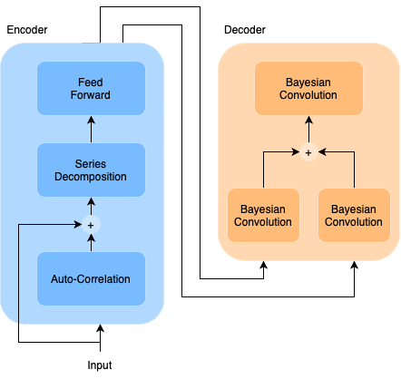
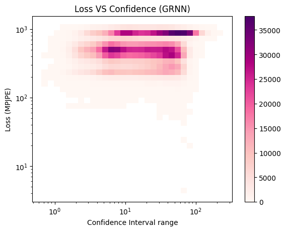
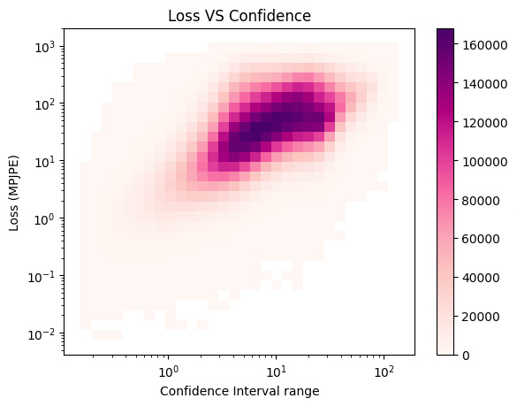
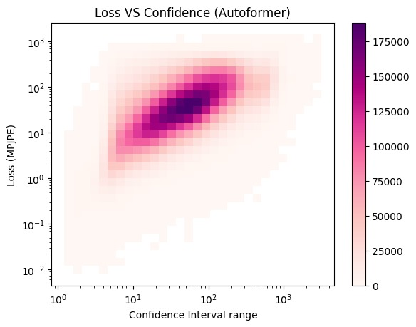

# Human Motion Forecasting with Bayesian Neural Networks

## Introduction

This repository presents a project on Human Motion Forecasting using Bayesian Neural Networks (BNNs). The goal is to predict human poses in dynamic scenarios, such as human-robot interaction and autonomous driving, while accounting for uncertainty.

## Repository Structure

The project is organized into distinct components, each housed in its respective directory:

- **data:** Contains datasets relevant to the project.
- **funcs:** Houses utility functions used across the project.
- **autoformer:** Implementation of the Autoformer model.
  - **weights:** Stores model weights.
  - **AutoCorrelation.py:** Auto-correlation implementation.
  - **Autoformer_EncDec.py:** Autoformer encoder-decoder implementation.
  - **Autoformer_Enc_only.py:** Autoformer encoder-only implementation.
  - **Embed.py:** Embedding-related functionality.
  - **Light_Autoformer.py:** Lightweight or specific configurations of the Autoformer.
- **gated_recurrent_nn:** Implementation of the Gated Recurrent Neural Network (GRNN).
  - **checkpoints:** Stores model checkpoints.
  - **decoder.py:** Decoder implementation for the GRNN.
  - **encoder.py:** Encoder implementation for the GRNN.
  - **model.py:** Overall GRNN model implementation.
  - **pos_embed.py:** Positional embedding implementation.
  - **prova.ipynb:** Jupyter notebook for testing purposes.
  - **testing.py:** Script or module for testing the GRNN.
  - **training.py:** Script or module for training the GRNN.
- **transformer:** Implementation of the Transformer model.
  - **pos_embed.py:** Positional embedding implementation.
  - **sta_block.py:** Spatio-Temporal Attention (STA) block implementation.
  - **sttformer.py:** Overall Spatio-Temporal Transformer implementation.
  - **transformer.py:** Overall Transformer model implementation.
- **utils:** Utility functions and modules.
  - **dataloader.py:** Data loading functionality.
  - **gated_recurrent_nn.py:** Utility functions related to the GRNN.
  - **loss.py:** Loss functions implementation.
  - **train.py:** Training-related functionality.
  - **visualizations.py:** Functions for creating visualizations.

## Process

1. **Data Preparation:** Relevant datasets are stored in the `data` directory.
2. **Model Implementations:** Autoformer, GRNN, and Transformer models are implemented in their respective directories.
3. **Training and Testing:** Utilize Jupyter notebooks (`training_autoformer.ipynb`, `training_grnn.ipynb`, `training_transformer.ipynb`, `testing.ipynb`) for model training and testing.
4. **Utility Functions:** `utils` directory contains utility functions for data loading, training, and visualization.
5. **Analysis:** Jupyter notebook (`analysis.ipynb`) for further analysis and evaluation.

## Models

1. **Gated Recurrent Units (GRUs):** work by using gates to regulate the flow of information. They have two gates: the update gate, which decides how much past information to retain, and the reset gate, which determines how much past information to forget. This mechanism allows GRUs to maintain relevant information over long sequences and discard irrelevant data, making them effective for tasks like Human Pose Forecasting where understanding temporal dependencies is key.

    

  
2. **Transformers:** renowned for their effectiveness in handling sequential data, are particularly adept at capturing spatio-temporal correlations through Self-Attention mechanisms. This feature enables them to simultaneously process and relate different positions within a sequence, making them highly suitable for tasks like Human Pose Forecasting. By focusing on Spatio-Temporal (ST) Attention, transformers can intricately understand both spatial relationships and temporal dynamics, crucial for accurately predicting human movements in both space and time.

    

3. **Autoformer:** effectively utilizes correlations between distant time stamps to enhance its predictive accuracy in tasks like Human Pose Forecasting. By identifying and leveraging these correlations, the model can understand the intricate relationships and patterns that unfold over time. This approach is especially beneficial in scenarios where long-term dependencies and the interconnectedness of past and future movements are critical. The Autoformer’s ability to tap into these correlations allows for more precise and reliable predictions of human poses, even across extended time sequences.

    

## Findings

- Comparative analysis shows that the Autoformer model is the most effective for Human Pose Forecasting.
- Bayesian Neural Networks provide uncertainty estimation, crucial for understanding model confidence.
- Training times are optimized through a hybrid approach in the Autoformer implementation.
- Future work includes refining loss functions and improving computational efficiency.

    
    
    

For detailed information, refer to the specific Jupyter notebooks and source code in each directory.

Feel free to explore, contribute, and provide feedback!

### Contact
- [Bellaroba Albachiara](mailto:bellaroba.1892618@studenti.uniroma1.it)
- [Leoni Paolo](mailto:leoni.1894985@studenti.uniroma1.it)
- [Migliarini Matteo](mailto:migliarini.1886186@studenti.uniroma1.it)
- [Protani Andrea](mailto:protani.1860126@studenti.uniroma1.it)
